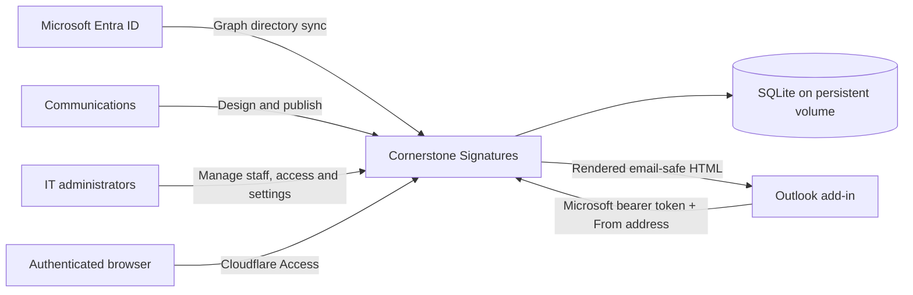

# Cornerstone Signatures

Cornerstone Signatures is a self-hosted email-signature management system for Microsoft 365. It gives IT control over directory data and access, gives Communications control over signature design and publishing, and automatically applies the correct signature while a user composes mail in Outlook.

It is designed for organizations that want the capabilities of a commercial signature-management platform without sending their directory and signature data to another SaaS provider.

## What it does

- Synchronizes staff and shared mailboxes from Microsoft Entra ID
- Applies signatures automatically in supported Outlook clients
- Supports personal mailboxes, Exchange shared mailboxes, and From-address changes
- Provides both a visual MJML editor and a direct HTML editor
- Publishes immutable template revisions to everyone or selected audiences
- Resolves overlapping audiences through configurable integer priorities
- Schedules future deployments and preserves deployment history
- Lets IT override inaccurate titles, office locations, and phone numbers without changing Entra
- Maps Entra office locations to exact text used in signatures
- Manages organization links, custom merge tags, approved taglines, and campaign content
- Supports optional per-user self-service opt-out and tagline selection
- Records administrative activity and signature-delivery counts
- Exports and imports the complete SQLite database from the admin interface

The application is deliberately small operationally: one Node.js process, one SQLite database, one persistent volume, and no external job runner.

## How it fits together



At compose time, Outlook sends the current **From** address to the signature API. The server checks eligibility, finds every active deployment matching that sender, selects the highest-priority one, and merges current staff and organization data into the published template snapshot.

Draft edits never reach users. Publishing creates an immutable deployment snapshot, while directory values, taglines, organization information, and custom plain-text tags are resolved when the signature is requested.

## Supported Outlook experiences

Cornerstone Signatures contains modern and classic event-based activation runtimes for:

- Outlook on the web
- New Outlook for Windows
- Classic Outlook for Windows
- Outlook for macOS
- Outlook for iOS and Android

The add-in reacts to new-message composition and supported **From** changes. Its task pane can preview the current assignment and reapply the latest signature to the open draft.

Exchange shared mailboxes can either use the signed-in employee's personal details or the mailbox record's own identity. Microsoft 365 Groups and aliases do not behave exactly like Exchange shared mailboxes and should be tested before broad deployment.

## Administration model

Two roles keep operational and editorial responsibilities separate:

| Role | Responsibilities |
| --- | --- |
| `it_admin` | Staff visibility and applicability, field overrides, roles, organization settings, Entra filters and scheduling, database transfer, audit export, and shared-mailbox identity |
| `communications_editor` | Templates, audiences, custom tags, taglines, previews, publishing, deployment scheduling, and campaign content |

An emergency `INITIAL_IT_ADMINS` environment setting bootstraps access to a new installation. Normal role management happens inside the application.

## Template and publishing model

Templates may be created in either format:

- **Visual MJML** — edited with GrapesJS and compiled authoritatively by MJML on the server
- **Legacy HTML** — direct control for teams that already have tested email-compatible markup

Both formats support managed merge tags:

```text
{{displayName}} {{firstName}} {{lastName}} {{title}}
{{phone}} {{email}} {{officeLocation}} {{locations}} {{tagline}}
{{organizationName}} {{websiteUrl}} {{facebookUrl}} {{instagramUrl}}
{{linkedinUrl}} {{xUrl}} {{threadsUrl}} {{blueskyUrl}} {{youtubeUrl}}
```

Communications can also define custom safe plain-text tags. Directory and custom values are HTML-escaped during rendering, and filesystem-backed `<mj-include>` elements are rejected.

Publishing can target all applicable staff or a reusable audience. If a person matches several active deployments, the deployment with the highest integer priority wins. Unpublishing a limited deployment makes its members fall back to their next match; scheduled deployments activate in-process without cron.

## Directory synchronization

The Entra integration uses Microsoft Graph application credentials to retrieve users and 48-pixel profile photos. Filters can limit imports by:

- enabled or disabled account state;
- member or guest user type;
- allowed email domains; and
- wildcard email exclusions.

Synchronization updates directory-owned values while preserving local roles, audience membership, visibility, applicability, self-service permissions, preferences, and title/location/phone overrides.

Deleting a managed record is temporary if it still matches the filters—it returns during a later sync. **Block** adds its exact address to the exclusion list before removing it, preventing re-import until an administrator removes that exclusion.

## Requirements

- Node.js 24 or later
- Docker or another Node 24 deployment environment
- A persistent filesystem mount at `/app/data`
- A public HTTPS origin
- Cloudflare Access for the browser picker and administration interface
- A single-tenant Microsoft Entra application registration
- Microsoft Graph `User.Read.All` application permission with tenant-wide admin consent
- Microsoft 365 administrator access to deploy the Outlook manifest

The Outlook runtime and signature endpoint must be reachable without a Cloudflare Access browser session. The signature endpoint independently validates Microsoft tokens; administrative APIs must remain behind Access.

## Quick start for development

```sh
cp .env.example .env
npm ci
npm run build:addin
npm test
npm run dev
```

The development command authenticates as the example bootstrap administrator. You can instead run `npm start` with your own `DEV_AUTH_EMAIL` and `INITIAL_IT_ADMINS` values.

`DEV_AUTH_EMAIL` bypasses normal browser authentication and must never be set in production.

## Production with Docker

Fill in `.env` from [.env.example](.env.example), then build and run the container:

```sh
docker build -t cornerstone-signatures:2.0.0 .

docker run --env-file .env \
  -p 3000:3000 \
  -v cornerstone-signatures-data:/app/data \
  cornerstone-signatures:2.0.0
```

The health endpoint is:

```text
GET /api/health
```

Do not replace or detach the persistent volume during upgrades. It contains staff, roles, settings, templates, audiences, deployments, schedules, taglines, custom tags, and audit history.

For the complete Access policies, Entra registration, permissions, manifest generation, and Microsoft 365 deployment sequence, follow the [deployment guide](docs/DEPLOYMENT.md).

## Outlook manifest

Tenant and hostname values are not committed. Generate a deployment-specific manifest from environment configuration:

```sh
npm run configure:addin
npm run build:addin
npm run validate:addin
```

Upload the generated `outlook-addin/manifest.xml` through Microsoft 365 **Settings → Integrated apps**. The file is intentionally ignored by Git. The running server also generates the configured manifest at:

```text
/outlook-addin/manifest.xml
```

A manifest change requires another upload to Microsoft 365. Template changes, directory synchronization, settings, and ordinary application releases do not.

## Configuration overview

The canonical list and explanatory comments live in [.env.example](.env.example). The main groups are:

| Area | Variables |
| --- | --- |
| Service | `PORT`, `DATABASE_PATH`, `PUBLIC_BASE_URL`, `SOURCE_CODE_URL`, `SUPPORT_EMAIL` |
| Rate limiting | `RATE_LIMIT_WINDOW_MS`, `RATE_LIMIT_MAX_REQUESTS`, `DATABASE_RATE_LIMIT_WINDOW_MS`, `DATABASE_RATE_LIMIT_MAX_REQUESTS` |
| Cloudflare Access | `CLOUDFLARE_TEAM_DOMAIN`, `CLOUDFLARE_ACCESS_AUD`, `ADMIN_ALLOWED_ORIGINS` |
| Microsoft Entra | `MICROSOFT_TENANT_ID`, `MICROSOFT_CLIENT_ID`, `MICROSOFT_API_AUDIENCE`, `MICROSOFT_GRAPH_CLIENT_SECRET` |
| Outlook add-in | `OUTLOOK_ADDIN_ID`, `OUTLOOK_PROVIDER_NAME`, optional `OFFICE_ADDIN_RUNTIME_URLS` |
| Bootstrap access | `INITIAL_IT_ADMINS` |

Secrets belong in the deployment platform's encrypted or masked secret store. Never commit `.env`, database exports, access tokens, or generated manifests.

## Backup and restore

The persistent volume should be included in infrastructure backups. IT administrators can additionally export a consistent point-in-time SQLite backup from **Manage → Data management** while the application remains online.

Imports validate the SQLite header, integrity, schema, required columns, foreign keys, template safety, and continued administrator access before replacing live state. Backups contain personal and access-control data and must be stored accordingly.

## Repository layout

```text
admin/             Administration single-page application
docs/              Deployment and administrator/user documentation
outlook-addin/     Outlook runtimes, task pane, icons, and manifest template
scripts/           Add-in build and manifest-generation tools
server/            Express application, SQLite model, authentication, and schedulers
static/            Staff-facing picker assets
tests/server/      Backend, rendering, deployment, and classic Outlook coverage
```

## Development and verification

```sh
npm ci
npm run build:addin
npm test
```

When validating a manifest, first provide the required environment settings and run `npm run configure:addin`. A production-equivalent container can be checked with:

```sh
docker build -t cornerstone-signatures:test .
docker run --env-file .env -p 3000:3000 cornerstone-signatures:test
```

Pull requests and pushes to `main` run the test suite, rebuild the Outlook bundles, and build the container. Tags matching `v*` publish multi-architecture images to GitHub Container Registry and create release artifacts through the workflows in [.github/workflows](.github/workflows).

## Additional documentation

- [Deployment guide](docs/DEPLOYMENT.md)
- [Administrator and user guide](docs/USER_GUIDE.md)
- [Contributing](CONTRIBUTING.md)
- [Security policy](SECURITY.md)
- [Changelog](CHANGELOG.md)

## License

Cornerstone Signatures is available under AGPL-3.0-only. Organizations requiring alternative terms may apply for a separate licence. Alternative licences may be provided without charge at the project maintainer’s discretion and are governed solely by their written terms.

The complete AGPL-3.0-only terms are included in [LICENSE](LICENSE).

If you run a modified version for users over a network, AGPL-3.0 requires you to offer those users the complete corresponding source for that version. Set `SOURCE_CODE_URL` to the public source tree for the exact deployment, including your modifications.
